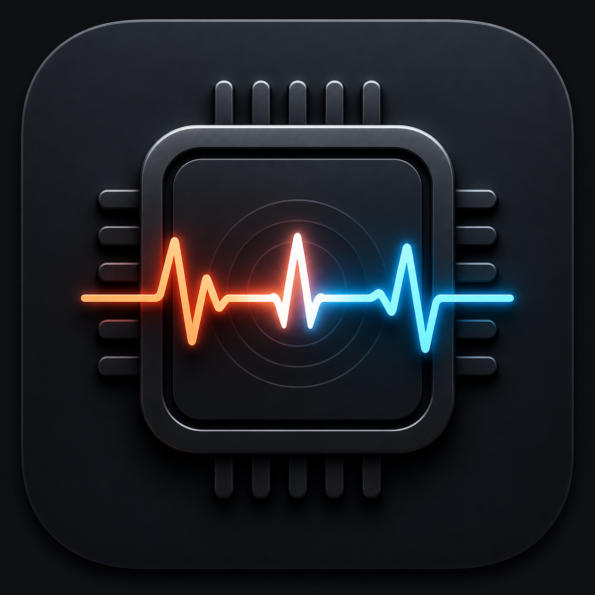

# CPUAlert

<p align="center">
  
</p>

<p align="center">
  A privacy-first macOS menu-bar monitor for real-time CPU, GPU, and memory pressure.
</p>

<p align="center">
  <a href="LICENSE"></a>
  
  
  
</p>

<p align="center">
  English · <a href="README.zh-CN.md">简体中文</a>
</p>

CPUAlert is a local, arm64 macOS 15+ menu-bar monitor for whole-machine CPU, GPU, and memory pressure. It keeps CPU and memory collection available when GPU collection is unsupported, shows only bounded live rankings, and uses an authenticated on-demand helper for the small set of root operations that cannot run in the app process.

The current release is **0.2.1 (Build 6)**. See the [changelog](CHANGELOG.md) for the complete update notes and validation record.

## Highlights

- A fixed-width C/G/M triptych for live whole-machine CPU, best-effort GPU, and memory pressure.
- Bounded CPU and physical-memory process rankings, expandable thread details, and expandable GPU application groups.
- Explicit memory release: select current-user applications, confirm, and ask them to quit normally; CPUAlert never runs `purge` or silently force-quits a batch.
- Sustained-pressure notifications with configurable thresholds and cooldowns.
- Safe process termination with PID-reuse protection, protected-process policy, confirmation, and fresh authentication for privileged actions.
- Launch-at-login controls, first-run guidance, diagnostics, and full English/Simplified Chinese localization.
- No network client, telemetry, analytics, account, or process-history database.

## Project status

CPUAlert is an early-stage open-source project. It targets Apple silicon and macOS 15 or later. CPU monitoring uses supported process APIs; GPU monitoring depends on undocumented IOReport and coalition interfaces and can stop working after a macOS update. See [Known limitations](#known-limitations) before relying on GPU values.

The repository contains source code and development fixtures. Local Apple Development signing is suitable for development on the signing Mac; a broadly distributed binary additionally requires Developer ID signing and notarization.

## Repository guide

- `CPUAlertApp/` — menu-bar application, collectors, alerts, settings, and UI.
- `CPUAlertHelper/` and `CPUAlertShared/` — narrowly scoped privileged helper and shared XPC types.
- `CPUAlertTests/` and `CPUAlertUITests/` — unit and deterministic UI acceptance tests.
- `TestFixtures/` — opt-in CPU and GPU stress fixtures.
- `Scripts/` — benchmark and process-sampling tools.
- `CHANGELOG.md` — versioned user-facing update notes and release validation.
- `docs/cpualert-implementation/` — requirements, design, and implementation task record.
- `docs/memory-monitoring-and-cleanup/` — memory monitoring, cleanup, and three-resource menu-bar specification.

## Metric semantics

- CPU process percentages are normalized against total whole-machine capacity. A process fully occupying one logical CPU on a 14-core Mac therefore contributes about `1 / 14` of whole-machine capacity.
- GPU menu usage is best-effort whole-machine utilization. GPU ranking rows scale each resource coalition's activity share by the current whole-machine utilization so the displayed values add up on the same scale. They remain estimates, not direct per-process GPU counters.
- Memory pressure-related usage is `active + wired + compressed`, capped at physical memory. Inactive/file-cache pages are intentionally not presented as memory that must be cleared. Process rankings use `ri_phys_footprint`.
- IOReport and coalition APIs are private/unsupported and may fail after an OS update. CPU monitoring continues and the UI reports `GPU —`; GPU alerts are disabled while the metric is unavailable.
- CPU and memory rankings share one bounded process scan; thread values are collected only for the one process the user expands.

## Build and run

Requirements:

- Apple Silicon Mac running macOS 15 or later.
- Full Xcode. Commands below select `/Applications/Xcode.app` explicitly because Command Line Tools alone cannot archive or sign the app.
- An Apple Development signing identity whose Team ID matches the app/helper requirements for this local build.

Create the ignored `Config/Local.xcconfig` with your Team ID:

```xcconfig
CPU_ALERT_DEVELOPMENT_TEAM = YOUR_TEAM_ID
```

Build and test:

```bash
export DEVELOPER_DIR=/Applications/Xcode.app/Contents/Developer

xcodebuild build \
  -project CPUAlert.xcodeproj \
  -scheme CPUAlert \
  -configuration Debug \
  -derivedDataPath build/DerivedData

xcodebuild test \
  -project CPUAlert.xcodeproj \
  -scheme CPUAlert \
  -destination 'platform=macOS,arch=arm64' \
  -derivedDataPath build/DerivedData
```

The app is an `LSUIElement`; launch the built `.app` and use its CPU/GPU/memory menu-bar item. It does not create a normal Dock icon.

The GPU fixture requires Xcode's official Metal toolchain component. If Xcode reports that it is missing:

```bash
DEVELOPER_DIR=/Applications/Xcode.app/Contents/Developer \
  xcodebuild -downloadComponent MetalToolchain
```

## Permissions and first use

- Notifications are opt-in. CPUAlert requests authorization only after the user presses the notification button; denial is a recoverable state and monitoring continues.
- Launch at login uses `SMAppService.mainApp`. CPUAlert changes registration only after a direct user toggle. If macOS requires approval, Settings opens the system Login Items page for the user.
- The first-run card can be dismissed without enabling either permission and can be restored from General settings.
- No helper is installed at launch. The first privileged termination or an explicit install action requests fresh local device-owner authentication, then invokes `SMJobBless`.
- Same-user `SIGTERM` stays in the app process. `SIGKILL` is a separate confirmed action. Root termination authenticates every time and rechecks PID plus process start time before signaling.
- The memory-release sheet starts with no selection, includes only current-user regular applications, and never escalates a batch to `SIGKILL`.

## Privileged helper and removal

`SMJobBless` is deprecated and is selected only for this local development build. Both app and helper still require matching signatures. The app pins the helper identifier and certificate Team ID; the helper independently pins the app identifier and the same Team ID before exporting its XPC object.

CPUAlert never runs arbitrary privileged commands. The helper accepts only fixed secure-coded operations, cannot accept a shell command, path, environment, or executable, and exits after 15 seconds idle. Protected system processes cannot be terminated through the app.

Preferred removal is Settings → Privilege → Remove Helper. It performs fixed authenticated cleanup and then calls `SMJobRemove`. If that path cannot run, the last-resort manual recovery commands intentionally reference only the two exact installation paths:

```bash
sudo launchctl bootout system /Library/LaunchDaemons/com.cpualert.helper.plist
sudo rm -- /Library/PrivilegedHelperTools/com.cpualert.helper
sudo rm -- /Library/LaunchDaemons/com.cpualert.helper.plist
```

Do not replace those paths with a directory, wildcard, environment variable, or recursive removal.

## Privacy

CPUAlert has no networking, telemetry, or upload path. It never uploads data and does not retain process history. Settings contain only thresholds and user preferences; samples, process rows, notification context, and thread details remain transient in memory.

The benchmark launcher also starts CPUAlert with a minimal environment because Instruments traces record target-process environment metadata. Every saved trace is scanned for sensitive environment-variable keys; a failing scan deletes the generated trace.

## Stress fixtures

The fixtures are standalone development tools and are never launched by the test suite:

```bash
build/DerivedData/Build/Products/Debug/CPUStress \
  --workers 1 --duty-percent 50 --seconds 10

build/DerivedData/Build/Products/Debug/GPUStress --seconds 10
```

`CPUStress` clamps workers to `1...activeProcessorCount`, duty to `1...100`, and duration to `1...300` seconds. `GPUStress` uses one Metal compute pipeline and a private buffer, clamps duration to `1...60` seconds, and both tools stop on `SIGTERM`.

## Release performance

Measured 2026-07-19 on a MacBook Pro with Apple M4 Pro (14 logical CPUs, 48 GB), macOS 26.5.2 (25F84), and Xcode 26.6 (17F113). Each row is a signed Release build measured for about five minutes while `xctrace` Time Profiler was attached.

| Mode | Duration (s) | Avg CPU | Avg resident footprint | Max resident footprint | Avg raw RSS | Package-idle wakeups/s |
|---|---:|---:|---:|---:|---:|---:|
| Closed panel, green | 300.025 | 0.0151% | 20.562 MB | 21.048 MB | 82.575 MB | 0.1033 |
| Panel open | 300.730 | 0.0728% | 156.142 MB | 161.626 MB | 120.366 MB | 0.2062 |
| Elevated CPU | 300.858 | 0.0409% | 21.202 MB | 21.438 MB | 82.612 MB | 0.0000 |
| Elevated GPU | 300.728 | 0.0373% | 21.107 MB | 21.391 MB | 82.595 MB | 0.3691 |
| Expanded thread | 300.767 | 0.0629% | 159.762 MB | 164.876 MB | 120.103 MB | 0.1962 |

The 40 MB memory gate uses `rusage_info_v4.ri_phys_footprint`, macOS's task-owned physical footprint. Raw RSS is reported separately because it includes shared framework pages and profiler mappings. WindowServer/SwiftUI surfaces make the two interactive modes materially larger; only the Plan's closed-panel green state has a memory gate.

Closed-panel green result:

| Gate | Limit | Measured | Result |
|---|---:|---:|---|
| Average CPU | ≤ 0.3% | 0.0151% | Pass |
| Resident footprint | ≤ 40 MB | 20.562 MB | Pass |
| Package-idle wakeups | ≤ 1/s | 0.1033/s | Pass |

The 0.2.1 memory-monitoring release also passed a 10.03-second closed-panel regression check: 0.0109% average CPU, 21.093 MB average physical footprint, and 0 package-idle wakeups/s.

Reproduce one mode or all five:

```bash
DURATION_SECONDS=300 Scripts/benchmark.sh green
DURATION_SECONDS=300 Scripts/benchmark.sh all
```

Generated JSON and `.trace` evidence stays under ignored `build/benchmarks/`.

## Known limitations

- GPU availability depends on undocumented IOReport schemas and coalition counters. OS updates can remove or rename the required channels.
- Coalition activity share is attribution among observed groups, not a percentage of total GPU hardware capacity.
- Memory-release estimates are process physical footprints, not a guarantee of bytes reclaimed; shared pages, compression, unsaved work, and application quit behavior affect the result.
- The legacy privileged-helper installation path is suitable for this local signed build, not a Mac App Store distribution.
- macOS may require manual notification or Login Items approval even after the app requests registration.
- The included XCUITest source uses deterministic launch states. On a machine where Xcode cannot enable UI automation mode, build the UI-test target and complete the equivalent English, Simplified Chinese, keyboard, and accessibility checks manually.

## Contributing and security

Bug reports, focused improvements, tests, and documentation fixes are welcome. Read [CONTRIBUTING.md](CONTRIBUTING.md) before opening a pull request. Please report security-sensitive problems through GitHub's private vulnerability-reporting flow as described in [SECURITY.md](SECURITY.md), rather than in a public issue.

## License

CPUAlert is licensed under the [GNU General Public License v3.0 or later](LICENSE) (`GPL-3.0-or-later`). If you distribute a modified version or a derivative work covered by the GPL, you must make the corresponding source available under the GPL as well. This is a strong copyleft license; Apache-2.0 is not, and would not impose that requirement.
